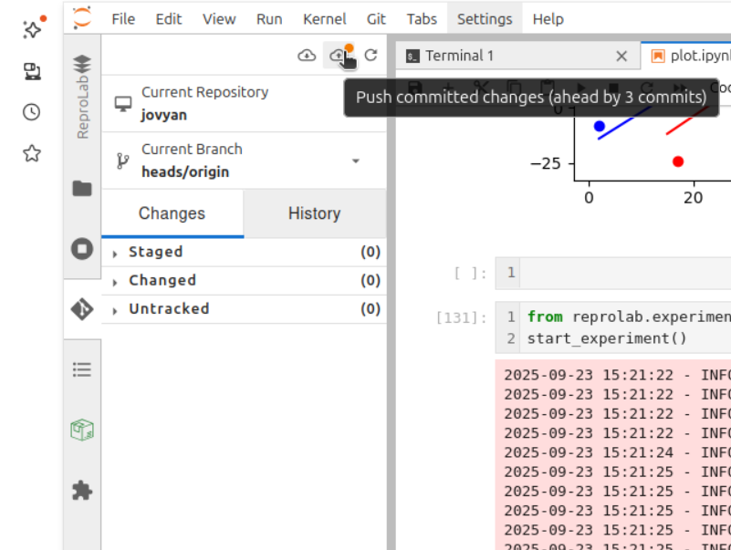

# Reprolab demo
> [!WARNING]
> This proof of concept only works if you run the code from a notebook in the home directory and requires you to set a gitignore to prevent all files in your virtual lab from being committed. Do not use this for actual virtual lab development.

## Getting started

1. Open the file browser and navigate to your home directory

   

2. Create a new Python notebook
> [!WARNING]
> Create the notebook in the home directory. This proof of concept only works if the Reprolab code is run from a notebook in the home directory.

> [!WARNING]
> Only Python is currently supported.

   

3. Open the Reprolab panel

   

4. Click on “Add Demo Cell”

   

## Reproducibility checklist

You can interact with the reproducibility checklist. Results are saved to `~/reprolab_data/reproducibility_checklist.json`

## Environment management

1. Click on “Create Environment”. This step can take while. This creates a new environment in `~/my_venv`.

   

   At this point, you can restart your virtual lab instance to use the newly-created environment as a notebook kernel. To do so, click on “File > Logout” and start the virtual lab again. You can then select the environment from the list of available kernels.

3. Click on “Freeze Dependencies”. This creates a list of the dependencies installed in the current environment in `~/requirements.txt`. This file can later be used to install the dependencies on a different machine.

## Experiment managment

To use the experiment management feature, we first need to create a git repository.

1. Open the terminal

   

2. Create a git repository for tracking the assets of your virtual lab. Also create a personal access token with "Read and Write access to code".
3. Type the following commands:

   ```shell
   git init
   git config --global user.email 'you@example.com'
   git config --global user.name 'You'
   git config --global --add safe.directory /home/jovyan
   git remote add origin [The git repository you created]
   echo -e '* \n!requirements.txt \n!reprolab_data/reproducibility_checklist.json \n!reprolab_data/*.pickle.pkl.gz \n!*.ipynb' > .gitignore
   ```
   The last command "`echo ...`" creates a gitignore file ignoring everything, except: `requirements.txt`, `reprolab_data/reproducibility_checklist.json`, any `.pickle.pkl.gz` files in `reprolab_data` and any `.ipynb` files in the home directory.

> [!WARNING]
> An improperly configured `.gitignore` can lead to committing secrets, making them detectable. To prevent this, only track files that do not contain sensitive data.

3. Go back to the notebook and click on “Create Experiment”.
4. Run the cell with `start_experiment()`. This commits your changes and creates a tag. In the next step, commit your changes.
5. Push the commit to git using your personal access token:

   

6. Perform your experiment.
7. Run the cell with `end_experiment()`.
8. Push the commit to git.

## Configure AWS S3 credentials for data archiving
This feature is currently not supported.

## Publishing software and data to Zenodo
This feature will create a `.zip` file that allows others to rerun your code outside NaaVRE. These files are about 2 Gb.
